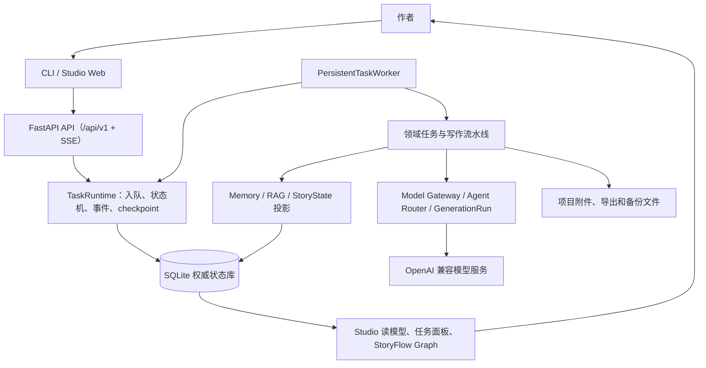
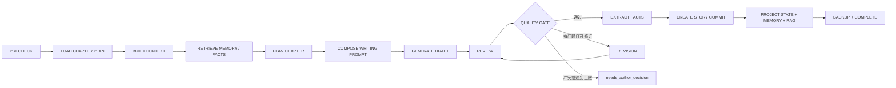
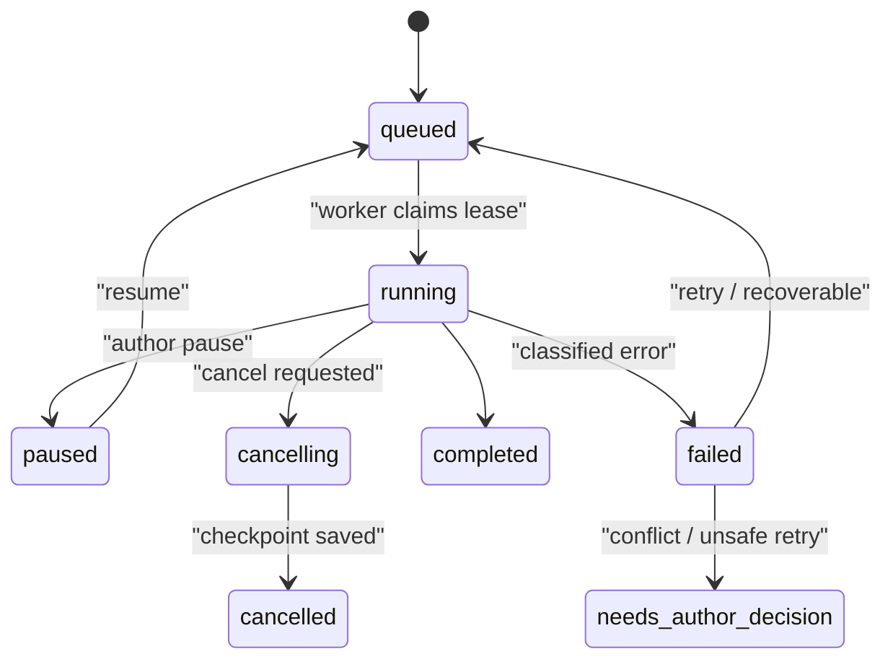

# NovelForge — AI 长篇小说创作工作台

[](https://github.com/2705911421/novelforge/actions/workflows/verification.yml)
[](https://opensource.org/licenses/MIT)
[](https://www.python.org/downloads/)
[](https://fastapi.tiangolo.com/)

**NovelForge** 是一个**本地优先**的 AI 长篇小说创作工作台。它将世界观设定、25 步 Story Bible、长篇规划、章节写作、记忆检索、质量审查、精准修订、连续创作、备份恢复和文档导出连接成一条**可暂停、可恢复、可追溯**的完整工作流。

融合了 inkOS 与 webnovel-writer 的设计思想，但以 **Python + FastAPI + SQLite** 独立运行：作品数据、执行状态、审查证据和任务记录全部持久化在本地，不依赖浏览器页面作为任务状态的唯一载体。

> 🚀 **项目仍在持续开发**。功能合同、验收入口和当前验证结论以 [`spec/features/`](spec/features/)、[`tests/`](tests/)、[`scripts/verify_features.py`](scripts/verify_features.py) 和 [`docs/IMPLEMENTATION_PROGRESS.md`](docs/IMPLEMENTATION_PROGRESS.md) 为准。本 README 说明使用方式和设计，不等同于生产就绪承诺。

## 适合谁使用

NovelForge 适合希望把“写小说”变成长期、可恢复工程的人：

- 需要维护复杂世界观、人物关系、时间线和伏笔的**长篇创作**；
- 希望 AI 只在明确的规划、上下文和质量门禁下生成内容的作者；
- 需要批量写作，但要求任务状态、审查证据和修订原因**持久可查**的团队或个人；
- 需要把参考资料、草稿、章节、审查报告统一管理并导出的创作者。

## ✨ 核心特性

### 🎨 创作与规划

- **25 步 Story Bible 工作流**：草稿、顺序确认、发布和带 SHA-256 校验和的版本快照；每步支持手填、AI 建议、优化和重生成。
- **长篇规划系统**：卷、故事弧、章节目标、剧情画布（Plot Canvas）、思维导图、时间线、世界地图和人物关系图。
- **多入口创作**：“念头创作”、“规划创作”、初稿导入和同人/衍生/风格模仿等模式，保留作者确认边界。

### 🤖 AI 写作与质量控制

- **智能写作流水线**：`PRECHECK → 规划 → 上下文编排 → 记忆检索 → 草稿生成 → 审查 → 质量门禁 → 修订 → Story Commit`。
- **双重质量门禁**：9 维度加权评分（剧情、人物、世界观、节奏、风格、伏笔、AI 痕迹等），通过阈值 93 分。
- **精准修订**：只针对已记录的问题或作者指令修订，不把无关文本“顺手润色”；冲突或达到修订上限时进入 `needs_author_decision`，**绝不伪造通过**。

### 📊 持久化任务与连续创作

- **SQLite 权威任务队列**：lease 租约、严格状态机、事件流（SSE 可回放）、checkpoint 和失败分类。
- **连续创作模式**：父任务 + 章节子任务结构，每章通过质量门禁后才推进下一章；支持 5–200 章，可暂停、恢复、取消。
- **跨章节联合审查**：默认每 5 章插入一次独立的跨章一致性审查任务。

### 🧠 记忆、RAG 与资料导入

- **多层记忆系统**：Working / Episodic / Semantic / Operational，覆盖角色状态、世界规则、时间线、伏笔、追读力等类别。
- **多格式资料导入**：TXT、Markdown、DOCX 的上传、解析、分块、指纹去重和来源追踪；解析与索引由持久化 worker 执行。
- **可复现检索**：SQLite BM25 始终可用，可选接入 embedding 与 rerank provider；结果携带文档、chunk、checksum、字符范围和检索策略。

### 🗺️ StoryFlow 故事画布

StoryFlow 是思维导图、剧情工作流、人物关系、时间线和世界地图收敛到**同一个 Story Graph** 的统一入口。当前已落地一个真实可用的 P0 vertical slice：

- 数据链路为 `SQLite 权威领域 → StoryGraphProjector → Graph API → StoryFlow Canvas`，画布不维护第二套故事事实；
- Full Graph 的 warm viewport、搜索和 Inspector/聚焦子图共享可重建的 SQLite `storyflow_graph_node_index` + `storyflow_graph_semantic_edge_index`；`storyflow_projection_epochs` 在权威行变更后失效并触发重建，节点/邻居/聚焦接口会明确报告 `projectionReadModel=sqlite_node_index+semantic_edge_index`，但当前仍不宣称完整 GPU virtualization；
- 高连接节点 Inspector 与普通跨视口边界页在 SQLite 端执行计数、排序和分页后才 hydration payload；邻居接口返回查询绑定的 `nextPageToken`，同时保留旧 `offset` 兼容路径；
- 默认打开 focused subgraph，支持 depth 1/2/3、类型/状态/章节范围过滤与搜索聚焦；
- Story / Character / Timeline / World / Foreshadow / Context 六种视图共享同一 Graph API；
- Inspector 展示来源、状态、章节和可追溯元数据；节点拖拽、框选、自动布局与布局保存只属于 UI workspace，不写入 StoryFact；
- 工作区布局历史独立保存为可重建的 revision snapshots；支持保存后的撤销/重做、撤销后新分支清理 redo tail，以及 Ctrl/Cmd+Z、Ctrl/Cmd+Shift+Z 快捷键，不改变 StoryState；
- 画布默认以“只读 · Canon”打开；Story Ports、章节计划、候选分支和候选决策等规划写入必须切换到“规划编辑”，而 AI 分析作为独立的只读报告任务可在 Canon 模式运行并持久化到 `tasks.result`。两种模式都不会从前端直接修改 StoryFact/StoryState；
- 在“规划编辑”模式下可从 StoryFlow 直接创建带标题、摘要和状态的 `PlanningNode`；若当前焦点有合法锚点，默认同时创建 revisioned `originates_from`/`planned_for`/`depends_on`/`affects` 语义边，使节点刷新后仍留在焦点子图中；所有写入仍属于 `plot_workspaces` overlay，绝不伪装成 Canon；
- 原思维导图、剧情工作流、时间线、世界地图、伏笔和人物关系入口现在优先路由到对应 StoryFlow view，旧渲染器仅作为兼容 fallback；
- 节点包含语义 Story Ports；例如 `Chapter.events → Location.presence` 只能选择并持久化为合法的 `happens_at` planning edge，非法节点/端口组合由后端 schema 拒绝；
- 候选分支以 revisioned `candidateBranchId` 分组保存，Inspector 可查看来源、分支序号和决策；采用/丢弃会整组转为 `PLANNED`/`SUPERSEDED`，不会直接污染 Canon；
- 同一次 forecast 的多个候选通过后端 task-scoped `candidateSetId=forecast:{taskId}` 在侧栏聚合比较；该 id 同时记录在任务结果与 `storyflow.forecast` manifest，Canvas 通过 `apply-candidate-set` 一次 revision 原子写入整组分支并支持重试幂等，旧 overlay 按 task/run/origin lineage 回退分组，候选集合支持聚焦、分支级采用/丢弃和“全部丢弃”，决策仍复用 revisioned planning API 并保留边 provenance；
- forecast 成功后候选覆盖层现在由持久化 worker 直接写入 `plot_workspaces`/`forecast_imports`，浏览器关闭也不会丢失；模型成功与规划投影成功分开报告，投影失败保留可重试的 task result，且不写入 StoryFact/StoryState/StoryCommit；
- 对于 worker 已完成但规划投影尚未落盘的历史 forecast，StoryFlow 侧栏会从持久化 `tasks.result` 显示安全的 `Recoverable forecasts` 摘要；规划编辑模式可用同一 revision-checked 原子事务恢复候选，重复点击幂等，且不会把 prompt/narrative 或候选规划伪装成 Canon；
- 候选集合现在可从侧栏进入只读“比较方案”Inspector：结果由 `GET .../story-graph/candidates/compare` 从同一 SQLite `plot_workspaces` 投影计算共同步骤、方案差异和语义边差异，不写入 Canon，也不把模型 narrative 当作事实；
- 选中任意真实 Flow 后可“保存章节计划”或“生成章节”：后者把结构化 `ChapterIntent` 写入现有规划控制面，并排队标准 `write-next` 任务，由既有 Prompt Registry、模型路由、GenerationRun 和 StoryCommit 完成后续写作；不会覆盖旧章节或绕过 Canon 边界；StoryCommit 接受后计划节点会变为 `ACCEPTED`，并以 `leads_to` 语义边指向实际生成章节；
- Context View 在存在真实 Writer `GenerationRun` manifest 时展示 included/excluded 语义边、来源字符数、GenerationRun provenance 和未解析的只读 `ContextSource`；现在还记录实际 context sections、Writer prompt components、包含原因和 section/prompt 绑定，点击来源可回到真实图节点；manifest 缺失或不匹配时明确显示 trace unavailable，不伪造 AI 上下文；Writer 输入还保留 `promptLayout`、`promptRange` 与 runtime 生成的 `persistedPromptRange` 字符区间，无法唯一定位时明确标记，不把字符范围冒充 Provider token 偏移；
- StoryFlow 保存的 `ChapterIntent` 现在可作为真实 Writer Context 来源：`storyflow_plan_node_id` 会把计划目标、前置条件、必需人物/地点、剧情线和伏笔动作写入现有 `GenerationRun` manifest；Context View 以 `PlanningNode`、`selectionRole=chapter_intent`、各选中图节点的角色及已持久化的语义边类型（如 `affects`、`advances`）展示“为什么加入”，缺失计划时记录明确 warning 而不伪造 provenance；
- Full Graph 在展开证据模式下使用服务端世界坐标视口查询；已加载页面会增量合并到当前 Story Graph，工具栏显示 `loaded / total`，拖拽期间只在 pointerup 后请求，且不会覆盖未保存的工作区坐标/折叠/固定/隐藏状态。它仍是渐进式加载与 DOM culling，不宣称真正虚拟化；
- Full Graph 的首个浏览器工作集现在固定为 `240` 个节点 / `600` 条语义边上限；展开 `All evidence nodes` 后才按视口向 SQLite 读取后续页，避免在建立 Canvas 视口前序列化 `1200/3000` 的兼容性大包。这个预算是 read-model transport 约束，不是 Canon 限制；
- 多选真实节点会通过只读 `GET .../story-graph/selection?nodeIds=...` 读取同一 SQLite Story Graph 的选区内语义流和选区外连接；Inspector 将它呈现为可执行的 StoryFlow working set，选区外远端节点可以触发新的权威 focus 查询，不会把未加载节点伪装成当前事实；
- 多选摘要在 read model warm 后复用同一 node/semantic-edge index，只 hydration 选中节点与远端边界摘要；权威数据变化会触发重建，不写入 Canon；
- 高连接度多选的选区外语义边在 SQLite 端做总数/类型聚合与分页，Inspector 首页 60 条并通过 query-bound `externalPageToken` 渐进加载；游标失效会显式报错，不混入不同选区或新 Canon；
- Character Inspector 现在把同一投影中的人物当前状态、位置、情绪、状态来源章节、最近出现、直接人物/势力关系、PlotThread 与 Foreshadow 关联分组呈现；缺失的 `character_states` 字段明确显示为“未记录”，不从 prose 推断，且可直接切入共享 Timeline 或持久化 StoryFlow AI 分析任务；
- 选中真实 Chapter 后，Inspector 会从同一 SQLite node-detail 邻接证据按人物/势力、地点、事件/场景、剧情线/冲突、伏笔/秘密、时间/设定分组，并分别列出“本章依赖 / 输入”和“本章改变 / 输出”；同时自动读取不可变 StoryCommit/History，展示已记录的事实与状态变化摘要，不把布局或前端推断当成 Canon；
- Story Bible 现在也进入同一 Story Graph：已发布 25 步快照、最近草稿快照和未发布步骤分别以 `StoryBibleEntry` 的 `CANON`/`DRAFT`/`PLANNED` 投影；Chapter 通过 `depends_on` 显示对当前已发布设定的规划依赖，GenerationRun 的 `story_bible` manifest 会解析到相同快照节点，而不是降级成无来源的图数据；点击设定节点可回到现有 25 步向导，Inspector 明确 Canon 与规划边界；
- 同一章节存在多个 Writer runs 时，Context View 可从 SQLite availableRuns 选择并通过 generation_run_id 精确读取；未知或越界 run 返回 404。component attribution 显示字符数、绑定/范围状态与 contentChars/4 estimate，整次 provider usage 仍是唯一实际 token 权威。
- Context View 还显示 `inputAccounting`：从 GenerationRun 的 persisted prompt layout 与 manifest ranges 计算字符级 union、重复覆盖、未追踪 Writer-message 字符和缺失来源范围；旧 run 会显示 `ranges_without_prompt_layout`/`ranges_without_prompt_length`，不把字符估算冒充 provider token。
- Writer `GenerationRun` 的 `context_manifest` 现在还持久化可校验的 `contextGraphSnapshot`：Context API 会重算节点/语义边 payload 的 SHA-256，Inspector 显示 included/excluded 来源、快照计数与 integrity 状态；旧 run 没有快照时明确显示 unavailable，不从当前图或 prompt 反推 AI 上下文。
- Forecast 与 StoryFlow Analysis 复用同一 GenerationRun Context Graph seam；Inspector 可按需读取真实 SQLite 快照，查看来源节点、included/excluded 语义边、focus、hash 完整性和 provenance 边界，且不暴露 prompt 正文或凭据。该能力已在 1920×1080 与 1366×768 headed browser fixture 中验收。
- World View 现在是有真实层级语义的 World Graph：Book 投影出 `World` 根，地点用 `locations.parent_id + type` 表达 `World → Region → City → Location`，控制/驻留/事件叠加分别追溯到 SQLite state/timeline 表；无坐标时明确标记 `spatialMap=false`，不把线性节点排列冒充地图。
- Foreshadow View 现在从 SQLite 权威字段和显式 typed StoryFact 投影 `planted → advanced → resolved` 生命周期；`advances`/`resolves` 边保留 fact/commit provenance，结构化人物/势力/地点/事件/剧情线关联使用 `involves` 语义边，Inspector 显示当前阶段与推进章节，不从自由文本推断伏笔进度。
- Scene、Item、Secret、StoryGoal、Conflict、TimelinePoint 和 Knowledge 等尚无独立权威表的扩展概念，只接受真实 StoryFact/结构化伏笔笔记中的 typed reference；每个节点保留 `referenceType`、`referenceId`、`story_facts` provenance，并从所属 Chapter 建立 `contains` 证据边。显式 `relation` 会继续通过 Story Ports/semantic edge validator 生成 `owns`、`reveals`、`advances`、`causes`、`knows` 等语义边，Inspector 明确标注 read-model evidence 而非新 Canon 表；
- 对尚无独立权威实体表的扩展类型，显式 typed `PlotThread` 引用会投影为可重建的 read-model 节点，并合并 `StoryFact` / `Foreshadow.notes` 的 SQLite provenance；未标注类型的字符串不会被提升为剧情事实。PlotThread Story Ports 的合法连接由统一 schema 校验。
- 已用 120 章真实 SQLite fixture 验收 progressive disclosure：默认焦点子图 9 节点，Depth 2 116 节点/307 语义边，浏览器 DOM viewport culling、搜索聚焦和刷新后的布局恢复均有证据；
- Graph History 支持 exact observed-snapshot pair diff；投影健康会把旧 ChapterVersion pending commit 标成 `STALE`、阻塞 Review 标成 `CONFLICT`，并在侧栏/Inspector 显示只读 diagnostics。History 明确标注 `observed_projection`，不冒充完整 canonical replay；对已接受的 `StoryCommit / StoryFact / StoryState` immutable ledger，另提供 commit-scoped Canon replay/diff 和 `canonicalGraphHistory` accepted-snapshot 时间线，保留 superseded 的已接受边界并对缺失 snapshot 明确断链，不把 mutable entity tables 伪造成历史；
- StoryFlow AI 分析任务写入现有 SQLite `tasks.result`，刷新后可从“最近 AI 分析”恢复选择与报告；分析结果仍是模型/任务产物，不自动变成 StoryFact 或 Canon；
- StoryFlow Chapter Inspector 可直接打开章节、审查、重写、查看版本；章节工作台补充“查看本章关系”并把真实 chapter id 带入 Character View。存在于 authoritative SQLite 但尚无 `chapter_versions` 的章节仍会返回 truthful empty history，而不会被误报成 404；
- 规划节点、候选分支和 AI 分析以 `PARTIAL` 状态持续迭代，当前不把未完成能力写成完整产品——详细边界见 [`docs/storyflow-canvas/`](docs/storyflow-canvas/) 与 [`docs/architecture/16-storyflow-canvas.md`](docs/architecture/16-storyflow-canvas.md)。

### 🖥️ Studio Web 工作台

StoryFlow 当前还包括真实的卷、故事时间、剧情线过滤；剧情线筛选由投影语义边反向建立稳定 ID/标题索引；Inspector 可读取只读 impact/history/diff 边界，并可对高连接度节点分页加载邻居；Canvas 对当前 bounded graph 做 DOM viewport culling，并保留完整 Minimap。Projector 通过 authoritative 字段内容指纹复用可重建 `storyflow_graph_catalog_cache`，指纹变化时自动重建；章节级事实、Commit、版本和审查阻塞项走批量读取，`chapter_versions` 新增也会失效缓存；Graph history 读取现有 ChapterVersion、StoryCommit、StoryFact、状态和 planning revision，并对已观察的 StoryGraph 投影提供 scoped snapshot diff，同时公开 `projectionHealth`。accepted StoryCommit 还可按章节顺序重放 immutable ledger 并比较 commit boundary；这不是对未版本化 mutable entity tables 的完整历史图重建。当前产品结论仍为 `PARTIAL`。

StoryFlow Canvas 现在还支持 Canvas 焦点快捷键（缩放、适配、重置、Depth、搜索、全选、清空、布局撤销/重做和保存）以及可点击 Minimap 导航；这些动作只改变导航或独立 UI workspace，不写入 Canon。真实浏览器证据见 `docs/storyflow-canvas/evidence/storyflow-20260813-hotkeys-minimap-*`。

Canvas 还会通过只读的 `GET .../story-graph/changes?fromSnapshot=...` 检测
长时间打开的工作台是否已经落后于 SQLite 中的新 Accepted StoryCommit：没有未保存
规划或布局操作时自动刷新；存在进行中的作者操作时显示
`CANON UPDATE · REFRESH REQUIRED`，不覆盖当前画布。该 freshness seam 复用
不可变 observed graph snapshot，不创建第二套故事事实，产品状态仍为 `PARTIAL`。

- **约 45 个页面**：我的创作、章节工作台、世界观向导、连续创作、StoryFlow、思维导图、时间轴、剧情工作流、世界地图、伏笔、人物关系、数据分析、联合审查、剧情推演、导入中心、任务管理、系统诊断等；
- **配置管理**：Provider / Model / Agent 九角色路由、Prompt 注册表、Skill 与 MCP 扩展管理；
- **实时流**：SSE 任务事件流，支持 `Last-Event-ID` 续传；
- **导出与交付**：Markdown、TXT、DOCX、Story Bible、审查报告、伏笔表和 JSON/ink 导出。

### 🔌 扩展与交付

- **提示词注册表**：按任务类型定制提示词，支持版本历史、回滚、导入导出；
- **Skill / MCP**：内置 28 个 Skill 指令契约，支持 GitHub 安全导入 Skill 包（不执行用户代码）；
- **翻译、互动影像、封面生成**、人物主题、题材库和文风设计等补充能力。

## 🚀 快速开始

### 系统要求

- Python 3.11 或更高版本
- SQLite（Python 标准库已提供）
- OpenAI 兼容的模型服务（执行真实 AI 生成时必须配置）

### 1. 安装环境

**Windows PowerShell：**

```powershell
python -m venv .venv
.\.venv\Scripts\Activate.ps1
python -m pip install -r requirements.txt
```

**macOS / Linux：**

```bash
python3.11 -m venv .venv
source .venv/bin/activate
python -m pip install -r requirements.txt
```

基础导入检查：

```bash
python verify.py
```

### 2. 配置模型服务

复制环境配置模板：

```powershell
Copy-Item .env.example .env
```

设置环境变量（PowerShell）：

```powershell
$env:OPENAI_API_KEY = "your-api-key"
$env:OPENAI_BASE_URL = "https://api.openai.com/v1"
$env:NOVELFORGE_LLM_MODEL = "gpt-4o"
$env:NOVELFORGE_REVIEW_MODEL = "gpt-4o"
$env:NOVELFORGE_ROOT = (Get-Location).Path
```

设置环境变量（macOS / Linux）：

```bash
export OPENAI_API_KEY="your-api-key"
export OPENAI_BASE_URL="https://api.openai.com/v1"
export NOVELFORGE_LLM_MODEL="gpt-4o"
export NOVELFORGE_REVIEW_MODEL="gpt-4o"
export NOVELFORGE_ROOT="$PWD"
```

### 3. 创建作品

```bash
python run.py init "我的第一部长篇" --genre "玄幻修仙"
```

命令会输出 `project_id`，后续命令都使用这个 ID：

```bash
python run.py list
python run.py status <project_id>
```

### 4. 启动持久化 worker

在一个终端运行 worker——它会从 SQLite 领取排队任务、写入阶段事件和 checkpoint，并执行世界观构建、文档索引、章节写作、审查和修订等工作：

```bash
python run.py worker
```

单次执行一个任务后退出：

```bash
python run.py worker --once
```

### 5. 启动 Studio

在另一个终端运行：

```bash
python run.py serve --host 127.0.0.1 --port 8000
```

打开 http://127.0.0.1:8000。也可以直接使用 Uvicorn：

```bash
python -m uvicorn src.web.studio:app --reload --port 8000
```

## 📚 完整使用教程

### 第一步：建立 Story Bible

使用向导把设定请求入队（由 worker 执行）：

```bash
python run.py wizard <project_id> --input "近未来城市中，记忆可以被交易；主角是一名记忆修复师。"
```

在 Studio 中打开 Story Bible 页面，逐步编辑 25 个步骤。CLI 查看状态：

```bash
python run.py bible <project_id> show
```

脚本化编辑：

```bash
python run.py bible <project_id> set <step_key> "这里写该步骤的草稿内容"
python run.py bible <project_id> confirm <step_key>
python run.py bible <project_id> publish
```

> 发布要求全部 25 步已确认，并生成带校验和的快照。严格模式下，写作流水线在发布 Story Bible 之前会被 PRECHECK 阻断。

### 第二步：导入参考资料

导入资料只负责保存文件并排队，不在 HTTP 请求中直接执行耗时解析：

```bash
python run.py ingest <project_id> ./references/world.md --type world
python run.py ingest <project_id> ./references/character.docx --type character
python run.py ingest <project_id> ./references/style.txt --type style
```

让 worker 执行解析和索引，然后用 RAG 查询：

```bash
python run.py rag-search <project_id> "主角与记忆交易的规则" --top-k 5
```

### 第三步：规划章节

在 Studio 中完成卷、故事弧、章节目标和剧情画布；也可以使用 CLI 的底层任务入口。开始写作前，系统会执行 preflight，检查 Story Bible、章节规划、模型配置、前序提交和投影状态。

### 第四步：写作单章

排队生成下一章：

```bash
python run.py write <project_id> 1 --context "本章让主角第一次发现交易记录被人为篡改。"
```

不指定章节号时，CLI 会从最新章节继续：

```bash
python run.py write <project_id>
```

任务完成后查看作品状态：

```bash
python run.py status <project_id>
```

### 第五步：审查、修订和复审

写作流水线会自动执行审查和质量门禁。需要显式调用时，Studio API 提供任务入口：

```text
POST /api/v1/books/{book_id}/audit/{chapter}
POST /api/v1/books/{book_id}/revise/{chapter}
POST /api/v1/books/{book_id}/rewrite/{chapter}
GET  /api/v1/books/{book_id}/chapters/{chapter}/reviews/latest
```

### 第六步：连续创作

连续创作适合已完成规划、希望批量推进的作品：

```bash
python run.py continuous <project_id> --start 1 --count 5 --context "保持冷峻、克制的叙述风格。"
```

`count` 范围是 5–200。CLI 会在启动前显示 token 和质量策略提示，并要求确认。

### 第七步：导出交付

```bash
python run.py export <project_id> --format md
python run.py export <project_id> --format txt --output ./exports/novel.txt
python run.py export <project_id> --format docx --approved-only
```

## 🧰 CLI 命令参考

| 命令 | 说明 |
|------|------|
| `python run.py init <name> [--genre] [--import-file]` | 初始化新作品，可选导入设定文件并排队世界观构建 |
| `python run.py wizard <project_id> [--input]` | 将世界观构建请求入队 |
| `python run.py ingest <project_id> <file> [--type]` | 保存资料附件并排队解析/分块/索引 |
| `python run.py rag-search <project_id> <query> [--top-k]` | 检索已索引文档分块 |
| `python run.py bible <project_id> show\|set\|confirm\|publish` | Story Bible 工作区操作 |
| `python run.py write <project_id> [chapter] [--context]` | 排队单章写作 |
| `python run.py continuous <project_id> [--start] [--count] [--context]` | 排队连续创作（5–200 章） |
| `python run.py export <project_id> [--format md\|txt\|docx] [--approved-only]` | 导出正文与审查报告 |
| `python run.py status <project_id>` | 查看作品状态（章节/角色/势力/伏笔等） |
| `python run.py list` | 列出所有作品 |
| `python run.py mindmap <project_id>` | 生成思维导图 HTML |
| `python run.py timeline <project_id>` | 生成时间轴 HTML |
| `python run.py serve [--host] [--port]` | 启动 Studio Web |
| `python run.py worker [--once] [--worker-id]` | 运行持久化任务 worker |

## 🏗️ 工作原理

### 总体架构

SQLite 是**单写入者**的权威事实库：API 只创建/读取任务并串流已持久化事件，不直接充当执行队列；一个持久化 worker 对每个 Task 持有 lease 并执行；文件系统只保存二进制附件、导出和备份。



### 单章写作流水线

每个方框都是一个 Task checkpoint 边界。Draft 只保存为不可变 `ChapterVersion`，绝不覆盖作者已编辑版本；质量门同时检查 blocking issue、最低分和所需 artifacts，超过修订上限时进入 `needs_author_decision`，不虚假通过。



### 任务状态与恢复



### 数据与安全边界

以下内容属于本地运行数据或生成物，默认不应提交到 Git：

| 路径 | 内容 | 处理方式 |
|------|------|----------|
| `projects/` | 作品、SQLite 数据库、附件和项目状态 | 本地保存，按需备份 |
| `.novelforge-secrets/`、`.env` | 凭据引用和环境配置 | 禁止提交；Windows 下密钥经 DPAPI 保护 |
| `.novelforge-backups/` | 数据库和附件备份 | 通过备份功能管理 |
| `exports/` | 正文、DOCX 和报告导出物 | 交付后单独保存 |
| `studio/` | Studio 会话和运行记录 | 本地缓存 |
| `test-output/` | 手工测试和诊断输出 | 不进入版本库 |

## 📁 项目结构

```text
src/
├── core/             # 数据库/迁移、DAL、StoryRepository、TaskRuntime、worker、备份恢复
├── pipeline/         # WritingPipeline、Composer、Observer/Reflector、RAG、Rules、节奏
├── creation/         # 连续创作服务、章节写手、规划器、任务处理器
├── planning/         # Story Bible、规划综合、剧情画布、创作工作流与就绪门禁
├── llm/              # Model Gateway、Agent Router、PersistentModelRuntime、GenerationRun
├── memory/           # 多层记忆引擎
├── rag/              # BM25 持久化检索、重排与来源追踪
├── ingestion/        # 文档上传、解析、分块、初稿导入
├── review/           # 章节审查、双重门禁、联合审查
├── export/           # Markdown / TXT / DOCX / 报告导出
├── prompts/          # 提示词注册表（版本化）
├── story_graph/      # StoryFlow：StoryGraphProjector 与规划服务
├── visualization/    # 思维导图、时间轴、世界地图
├── themes/           # 人物主题
├── translation/      # 翻译项目
├── interactive_film/ # 互动影像图运行时
├── wizard/           # 世界观构建向导
├── integrations/     # Skill / MCP 注册与安全导入
├── web/              # FastAPI Studio（studio.py）与静态页面
└── cli/              # Click 命令行入口
config/default.yaml   # 默认运行配置（LLM、审查、连续创作、导出、记忆）
docs/                 # 架构（architecture/）、阶段（phases/）、审计（audit/）、StoryFlow
spec/features/        # 功能合同与验收入口（受保护）
scripts/              # verify_features / generate_progress / check_protected_files
tests/                # 单元、集成、API、持久化、敌对路径测试
projects/             # 本地运行时作品数据（不提交 Git）
```

## ⚙️ 配置说明

### 环境变量

| 变量名 | 描述 | 示例 |
|--------|------|------|
| `OPENAI_API_KEY` | 主模型 API 密钥 | `sk-...` |
| `OPENAI_BASE_URL` | 主模型基础 URL | `https://api.openai.com/v1` |
| `NOVELFORGE_LLM_MODEL` | 主写作模型 | `gpt-4o` |
| `NOVELFORGE_REVIEW_API_KEY` | 审查模型密钥（可选，独立路由） | `sk-...` |
| `NOVELFORGE_REVIEW_BASE_URL` | 审查模型基础 URL（可选） | `https://api.openai.com/v1` |
| `NOVELFORGE_REVIEW_MODEL` | 审查模型 | `gpt-4o` |
| `NOVELFORGE_ROOT` | 项目根目录 | `/path/to/novelforge` |

### 配置文件

主要配置位于 [`config/default.yaml`](config/default.yaml)，包含 LLM 主/审查/生图模型、审查参数（`pass_score: 93`、`max_revision_rounds: 3`、`joint_review_interval: 5`）、连续创作设置、导出选项、记忆与可视化配置。

Provider / Model / Agent 路由在 Studio 的 **AI 配置**页持久化到 SQLite；原始 API Key 不写回数据库，Windows 下通过用户级 DPAPI 保存，或使用 `env:` 引用。

## 🧪 测试与验证

### 运行测试套件

```bash
# 运行所有测试
python -m pytest -q --tb=short

# 运行特定测试
python -m pytest tests/test_phase8_writing_pipeline.py -v

# 代码风格检查
ruff check src tests

# 类型检查
pyright src tests
```

### 验证工具

```bash
# 核心模块导入与对象烟测
python verify.py

# 功能合同验收（spec/features/*.yaml 指向的验收测试）
python scripts/verify_features.py

# 进度报告（合同结果）
python scripts/generate_progress.py --verify

# 受保护验证资产检查
python scripts/check_protected_files.py
```

### CI / CD

GitHub Actions 的 `Verification` workflow 包含三个 job：

1. `protected-artifacts`：保护文件检查；
2. `acceptance`：合同验收（`verify_features.py` + `generate_progress.py`）；
3. `quality`：`ruff` + `pyright` + `verify.py`。

> 已知基线（见 [`docs/IMPLEMENTATION_PROGRESS.md`](docs/IMPLEMENTATION_PROGRESS.md)）：测试套件数百项通过、ruff 通过、pyright 0 errors、5 个 P0 功能合同 VERIFIED；真实第三方 Provider E2E 未配置用户凭据时不会执行。

## 🛠️ 开发指南

### 本地开发

```bash
git clone https://github.com/2705911421/novelforge.git
cd novelforge
python -m pip install -r requirements.txt
python run.py --help
```

### 提交前检查

```bash
python -m pytest -q --tb=short
ruff check src tests
pyright src tests
python verify.py
python scripts/verify_features.py
python scripts/generate_progress.py --verify
```

如果某个命令因本地环境、模型凭据或外部服务不可用而未运行，请在 Pull Request 中明确写出原因，不要用跳过或弱化测试代替验证。

### 变更边界

- 不要提交 `projects/`、本地数据库、备份、日志、缓存、浏览器产物或真实凭据；
- `spec/features/**`、`tests/acceptance/**`、`scripts/verify_features.py`、`scripts/generate_progress.py`、`scripts/check_protected_files.py` 属于**受保护验证资产**，除非验证需求本身发生变化，否则不要修改；对测试有异议时在 `docs/test-change-requests/` 提交说明；
- 涉及 Story System、写作流水线、Review Gate、Revision、Continuous Writing、Memory/RAG 或 Backup/Restore 的改动，需要覆盖成功、失败、持久化和恢复路径；
- 质量门禁失败或自动修订轮次耗尽时，章节必须进入 `needs_author_decision`（等待作者），不得伪装通过。

详细约束见 [`CLAUDE.md`](CLAUDE.md) 与 [`CONTRIBUTING.md`](CONTRIBUTING.md)。

## 📖 设计文档与许可证

完整架构、阶段说明、审计和验证证据位于 [`docs/`](docs/)。功能合同位于 [`spec/features/`](spec/features/)。

重要设计文档：

- [`DESIGN.md`](DESIGN.md)：整体设计摘要与对标
- [`docs/architecture/01-system-architecture.md`](docs/architecture/01-system-architecture.md)：系统边界和进程关系
- [`docs/architecture/04-writing-pipeline.md`](docs/architecture/04-writing-pipeline.md)：单章写作流水线
- [`docs/architecture/05-review-pipeline.md`](docs/architecture/05-review-pipeline.md)：审查模型和问题证据
- [`docs/architecture/06-revision-pipeline.md`](docs/architecture/06-revision-pipeline.md)：修订边界和作者决策
- [`docs/architecture/09-task-system.md`](docs/architecture/09-task-system.md)：任务状态、lease 和错误分类
- [`docs/architecture/10-continuous-writing.md`](docs/architecture/10-continuous-writing.md)：连续创作的父子任务设计
- [`docs/architecture/15-backup-recovery.md`](docs/architecture/15-backup-recovery.md)：备份与恢复规则
- [`docs/architecture/16-storyflow-canvas.md`](docs/architecture/16-storyflow-canvas.md)：StoryFlow Canvas 当前边界
- [`CLAUDE.md`](CLAUDE.md)：工程约束、受保护验证文件和交付要求

安全问题请参阅 [`SECURITY.md`](SECURITY.md)。本项目采用 [MIT License](LICENSE)。

## 🤝 社区与支持

- **GitHub Issues**：报告 bug 和功能请求
- **GitHub Discussions**：社区讨论和问题解答
- **文档**：完整项目文档位于 [`docs/`](docs/) 目录

## StoryFlow AI action provenance

StoryFlow analysis is now a durable, inspectable task boundary. When a
completed `storyflow-analyze` task has a persisted `GenerationRun` and context
manifest, the Canvas can restore the report after refresh and show a safe
provenance summary: run/agent/provider/model metadata, whole-run usage,
selection, context counts and source types, and persisted character-range
coverage. Prompt bodies and credentials are intentionally not exposed, and a
missing or mismatched manifest remains explicitly unavailable. This is a
read-only explainability surface; analysis findings do not become Canon.

The same Inspector now exposes `生成三个候选分支` only in Planning Edit mode.
The action reuses the forecast task boundary. When launched from a restored
analysis report, the worker validates the same-book completed analysis task and
successful source `GenerationRun`, then carries both ids into the forecast
manifest, Context Graph, and revisioned Candidate overlay. The bounded analysis
result is planning input only; it does not become Canon. Candidate branches
remain planning data until an explicit product decision and later canonical
acceptance; provider-backed branch generation is still provider-dependent.

Candidate branches can also be reforecast from Planning Edit. The action keeps
the parent candidate set/branch/root ids in the existing SQLite planning
overlay and GenerationRun manifest, validates the parent before the model
gateway, and never writes StoryFact or StoryState directly. This lineage slice
is implemented and tested; live provider execution remains configuration-
dependent and the broader StoryFlow roadmap remains `PARTIAL`.

The Candidate Branch Inspector also exposes `查看谱系`. It queries the same
SQLite `plot_workspaces` overlay through the bounded
`story-graph/candidates/lineage` API, follows exact parent/child identifiers,
and renders semantic `originates_from` edges without guessing missing parents.
The read-only result is explicitly planning-only; adopted or discarded parent
roots remain traceable for lineage history while the active candidate decision
list is unchanged. A full refresh reconstructs the view from SQLite rather than
front-end state.

Forecast runs now persist a safe `storyflow.forecast` context manifest for the
selected StoryFlow nodes/edges and planning inputs. Candidate Inspector can
read the associated GenerationRun summary by book-scoped API; prompt bodies
and credentials remain outside the canvas surface.

Context View now exposes the persisted GenerationRun inclusion record for each
source: reason, selection role, focus/depth, planned chapter, semantic evidence,
and the metadata-only provenance boundary. The Inspector explicitly says when
causality was not recorded instead of inferring it from layout or prompt prose;
the overall StoryFlow roadmap remains `PARTIAL`.

StoryFlow analysis findings now preserve the selected-node provenance boundary
(`selectionRole`, focus, depth, observed semantic edge types, and provenance
kind) in the existing GenerationRun manifest. Evidence ids in a restored
analysis report are clickable: they navigate through the shared Story Graph
API to the corresponding focused projection and Inspector. This remains a
read-only analysis artifact and does not mutate Canon; high-degree Character
radial layout readability is still an open follow-up, so the roadmap remains
`PARTIAL`.

## StoryFlow impact explanation

The History Inspector also supports `Version compare`: it reads two real
immutable `ChapterVersion` ids, returns a deterministic text diff, includes
attached commit summaries when available, and shows the bounded dependency
surface that the current Story Graph records. The surface is explicitly
`current_projection`, not a fabricated historical graph for mutable entity
tables; when both versions have real commits, `canonicalSurface` also reads
the acceptance-time `story_projections.payload` state and commit-linked facts,
including superseded → accepted boundaries. When both accepted commits have a
valid full-catalog projection snapshot, the same surface exposes a bounded
`historicalGraph` diff and `graphReplayComplete=true`; missing capture remains
an explicit ledger-only result. This does not version mutable source tables
independently, and the endpoint is read-only.
The endpoint is read-only and the product status remains `PARTIAL`.

The Chapter Inspector's read-only impact action now distinguishes recorded
Canon/Accepted facts from Planning/Candidate overlays. Each affected node is
labelled with an `impactBoundary`, `evidenceStatus`, and deduplicated SQLite
source evidence (`StoryFact`, `StoryCommit`, `StoryState`, or Planning). When
the graph has no recorded source, the UI says `node_projection_only` instead of
inferring causality from layout or prose. This is a source-backed impact
explanation slice; the overall StoryFlow roadmap remains `PARTIAL`.

Chapter Inspector 还提供只读的 `编辑影响` 报告：它从真实
`ChapterVersion`、`StoryCommit`、`StoryState` 和语义边读取当前版本、被
supersede 的 Canon 边界、stale 状态、后续章节与受影响事实，并明确要求
重新提取/接受。`GET .../story-graph/chapter-impact/{id}` 不会从正文相似度、
布局或普通连线推断未来 Canon，也不会直接写入权威表。

章节的 `StoryCommit / History` 现在会为每个真实 `ChapterVersion` 提供
`查看编辑影响`；点击旧版本会把该行的 SQLite `sourceId` 作为 `versionId`
钉选到只读 Inspector，历史列表仍保留在报告下方，便于比较版本而不改变
StoryFact、StoryState 或 StoryCommit。

---

**⭐ 如果这个项目对你有帮助，请给我们一个 Star！**
### StoryFlow dense Character View

Character View now defaults to a real SQLite-backed `presentation=clustered`
projection for high-degree focused subgraphs. Activity Cluster cards are
explicitly view-only aggregates: they list exact source nodes and semantic edge
types, can be expanded into real Chapter/Event nodes, and never become Canon.
Use `All evidence nodes` when the full bounded projection is needed. Layout
coordinates remain UI workspace state, and saved node positions are preserved
when the presentation projection is recalculated. Browser evidence is recorded
under `docs/storyflow-canvas/evidence/storyflow-20260813-character-cluster-*`.

### StoryFlow explicit Full Graph

Full Graph is an explicit, bounded view rather than the default entry. It uses
the same SQLite-backed Story Graph API with `limit`/`edge_limit` bounds and a
grid layout. Dense Story and Full Graph projections can use view-only Activity
clusters; `All evidence nodes` restores the real projected nodes. This is a
progressive-disclosure and density boundary, not full graph virtualization.
Evidence for the real 120-chapter fixture is recorded under
`docs/storyflow-canvas/evidence/storyflow-20260813-full-graph-*`.

## StoryFlow bounded Full Graph working-set budget (2026-08-14)

The explicit Full Graph entry now starts with the same bounded working-set
budget as its world-coordinate viewport pages: `limit=240` and
`edge_limit=600`. The browser then requests the visible rectangle through the
existing SQLite spatial/node/semantic-edge read model and merges returned pages
by id. The authoritative totals remain visible separately (`loaded / total`),
and boundary edges remain queryable from the selected-node Inspector.

On the real 500-chapter fixture, the first expanded request returned 240 nodes
and 476 internal semantic edges against 1,892 authoritative nodes and 7,489
edges. The subsequent viewport pages advanced the Canvas working set to 480
and then 720 loaded nodes without replacing local workspace state; the browser
diagnostic log was empty. This is a real transport-budget improvement and
progressive disclosure seam, not full GPU virtualization or a production FPS
claim. Evidence: `docs/storyflow-canvas/evidence/storyflow-20260814-bounded-viewport-1280.png`.

## StoryFlow server-side viewport increment (2026-08-13)

Full Graph remains an explicit bounded view. In All evidence mode, the existing
Story Graph API can now accept `x_from`, `x_to`, `y_from`, `y_to`, and
`viewport_padding` to return a stable world-coordinate viewport slice after
layout, while preserving authoritative SQLite totals in `meta.viewport`. The
browser uses this boundary after Canvas pan/zoom and continues native DOM
culling. This is an incremental read seam, not a claim of GPU rendering or
complete virtualization; the current product status remains `PARTIAL`.
The viewport metadata also reports the exact count/type summary of semantic
edges crossing the loaded page, plus a bounded remote-endpoint sample. The
toolbar and selected-node Inspector expose this as recorded SQLite evidence;
remote endpoints are not silently rendered or persisted in the browser. The
existing paged neighbors API remains the exact high-degree inspection path.

Boundary semantics are page-relative rather than client-cache-relative: a
remote endpoint cached from an earlier world-coordinate page is still shown as
off-page evidence for the current page. Clicking that Inspector row starts a
new authoritative focus query; it does not invent or write a story fact.

StoryFlow writing actions now open a structured Chapter Intent preview before
writing a planning overlay or queueing a chapter. The preview is returned by
the real Graph API with `save=false`; author confirmation creates a revisioned
PLANNED node, while “生成章节” then hands the confirmed plan and optional
guidance to the existing `write-next` runtime. This preserves the Canon
boundary and makes the selected Flow inspectable before AI work begins.

StoryFlow also includes a read-only Story Health projection. It reports long-
unadvanced PlotThreads, unresolved Foreshadows, and inactive or never-recorded
Characters from explicit SQLite lifecycle/appearance evidence. Clicking a
signal focuses the real node in its type-specific view; the panel does not
infer from prose or write Canon. Product status remains `PARTIAL` while the
broader Context/Planning/AI roadmap continues.

The Canvas workspace also supports reversible Hide/Delete interactions: hidden
real nodes appear immediately in a recoverable sidebar list, and Restore keeps
the change local until the author saves the layout. Opening Character,
Foreshadow, Location, or Faction sources from an Inspector preserves the node
focus while switching to the corresponding shared StoryFlow view. Browser
evidence is recorded under
`docs/storyflow-canvas/evidence/storyflow-20260813-hidden-restore-*` and
`storyflow-20260813-node-action-focus-1366.png`.

### StoryFlow writing-to-Canon verification

The production `PersistentTaskWorker -> LegacyTaskHandlers -> WritingPipeline`
path now has an integration contract that reaches the authoritative
`StoryRepository` boundary. After an accepted commit, the same SQLite-backed
projector exposes the new Chapter and extracted StoryFact as `CANON` nodes and
semantic edges; the open Canvas can discover the change through its read-only
freshness poll. The deterministic fixture harness is
[`scripts/run_storyflow_deterministic_write.py`](scripts/run_storyflow_deterministic_write.py)
and the browser evidence is recorded under
[`docs/storyflow-canvas/evidence/`](docs/storyflow-canvas/evidence/). This
validates task-to-projection synchronization without claiming live external
provider quality; the overall StoryFlow roadmap remains `PARTIAL`.

Accepted Canon commits that lose their post-acceptance StoryFlow snapshot now
retain the derived source fingerprint/revision failure boundary. History and
`POST .../story-graph/snapshots/retry` can recover only when that boundary is
unchanged; a Character/Location/source mutation produces an explicit refusal,
and the endpoint declares `canonicalMutation=false`.

Chapter Version Compare now also exposes a separate historical dependency
surface when both accepted StoryCommit graph snapshots exist. It shows changed
graph seeds and bounded semantic downstream dependencies in the Inspector;
missing snapshots remain explicitly ledger-only rather than being inferred
from current mutable tables.

### StoryFlow dense semantic-edge rendering

StoryFlow now uses a hybrid edge presentation for bounded dense viewports. The
same SQLite-derived semantic edge records are painted on one 2D Canvas surface
when at least 40 edges are visible after culling; sparse views continue using
SVG so semantic labels and port previews remain compatible. Canvas hit testing
opens the same provenance-aware edge Inspector, and switching back to sparse
mode clears the paint surface. This improves the real 500-chapter fixture's
large-view usability without claiming GPU virtualization or changing Canon.
The current product verdict remains `PARTIAL`.

### StoryFlow viewport semantic-edge pagination

Full Graph now keeps node-page and semantic-edge-page cursors separate. The
SQLite-backed Graph API exposes `edge_page_token` and exact
`internalEdgeCount`; the Canvas merges returned edges by id and offers
“Load more semantic edges” without replacing the current node working set.
This makes relationships between cards arriving on different viewport pages
observable while preserving the Canon/read-model boundary. It remains a
bounded read-model increment, not full GPU virtualization; the product
verdict remains `PARTIAL`.

### StoryFlow visual surface

The authoring workbench now opens on NovelForge's warm paper theme. The
existing dark theme remains available as an explicit user preference; theme
changes affect only UI presentation and never mutate SQLite Story Graph,
Canon, or workspace layout state. StoryFlow also reads the existing creation
preflight contract and visibly distinguishes model runtime `READY`, `SETUP
REQUIRED`, `UNAVAILABLE`, and `CHECKING`; saving revisioned planning remains
available when Provider/model setup is incomplete, while model-backed actions
are gated with a link to the existing AI configuration page.
The same readiness contract is enforced for direct StoryFlow API callers:
forecasting, selection analysis, and Flow-to-chapter generation return
`LLM_PROVIDER_REQUIRED` before creating a task when the model role routes are
not ready; planning-only node and Chapter Intent saves remain available.
