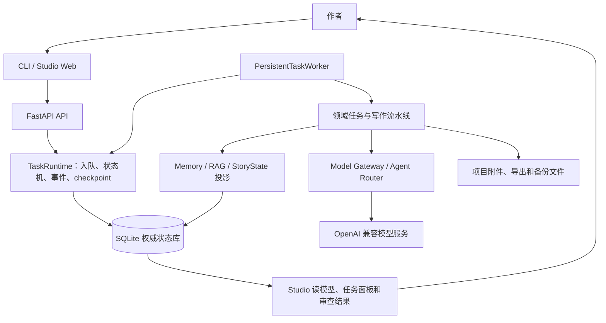
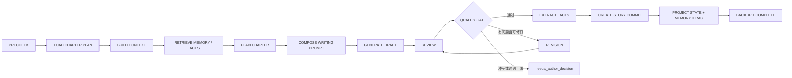
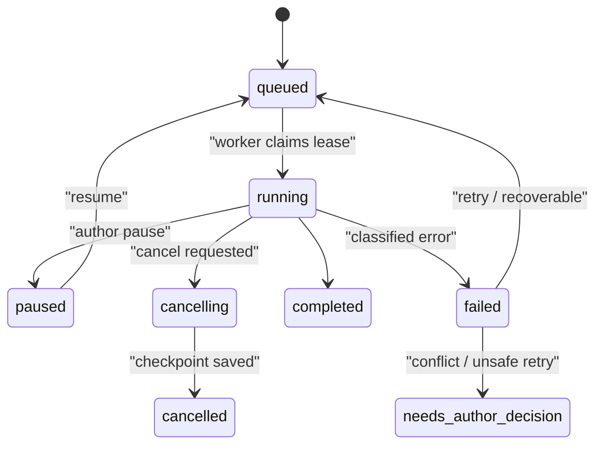

# NovelForge

[](https://github.com/2705911421/novelforge/actions/workflows/verification.yml)

NovelForge 是一个本地优先的长篇小说创作工作台。它把世界观设定、Story Bible、长篇规划、章节写作、记忆检索、质量审查、修订、连续创作、备份恢复和文档导出连接成一条可暂停、可恢复、可追溯的工作流。

项目提供两种入口：

- CLI：适合脚本化操作、批量任务和服务器环境。
- FastAPI + Studio Web：适合可视化管理作品、章节、任务、审查结果、模型配置和扩展。

NovelForge 默认把作品数据和运行状态保存在本地 SQLite 与项目目录中。模型调用通过 OpenAI 兼容接口完成；没有模型凭据时，仍可运行本地测试、查看结构和使用不依赖真实模型的功能。

> 项目仍在持续开发。功能合同、验收入口和当前验证结论以 [`spec/features/`](spec/features/)、[`tests/`](tests/)、[`scripts/verify_features.py`](scripts/verify_features.py) 和 [`docs/IMPLEMENTATION_PROGRESS.md`](docs/IMPLEMENTATION_PROGRESS.md) 为准。本 README 用于说明使用方式和设计，不等同于生产就绪承诺。

## 目录

- [适合谁使用](#适合谁使用)
- [核心能力](#核心能力)
- [StoryFlow 故事画布](#storyflow-故事画布)
- [快速开始](#快速开始)
- [完整使用教程](#完整使用教程)
- [工作原理](#工作原理)
- [流程设计](#流程设计)
- [数据与安全边界](#数据与安全边界)
- [项目结构](#项目结构)
- [开发与验证](#开发与验证)
- [常见问题](#常见问题)
- [设计文档与许可证](#设计文档与许可证)

## 适合谁使用

NovelForge 适合希望把“写小说”变成长期、可恢复工程的人，尤其适合以下场景：

- 需要维护复杂世界观、人物关系、时间线和伏笔的长篇创作。
- 希望 AI 只在明确的规划、上下文和质量门禁下生成内容。
- 需要批量写作，但不希望浏览器页面成为任务状态的唯一载体。
- 需要保留章节版本、审查证据、修订原因和可恢复任务记录。
- 需要把参考资料、草稿、章节和审查报告统一管理并导出。

## 核心能力

### 创作与规划

- 作品、Book、Chapter 和章节版本的持久化管理。
- 25 步 Story Bible 工作流：草稿、顺序确认、发布和版本快照。
- 长篇规划、章节计划、剧情画布、思维导图、时间线、世界地图和关系图。
- “念头创作”和“规划创作”等不同入口，并保留作者确认边界。

### AI 写作与质量控制

- `PRECHECK → 规划 → 上下文编排 → 记忆检索 → 草稿生成 → 审查 → 质量门禁 → 修订 → Story Commit` 写作流水线。
- 审查结果结构化保存，包含维度、问题、证据位置和可执行修订指令。
- 修订只针对已记录的问题或作者指令，不把无关文本悄悄重写成“顺便润色”。
- 质量门禁失败、冲突或达到自动修订上限时进入 `needs_author_decision`，不会伪造通过。

### 持久化任务与连续创作

- SQLite 任务队列、worker lease、状态机、事件流和 checkpoint。
- 任务支持暂停、恢复、协作式取消、失败分类和受控重试。
- 连续创作由父任务和有依赖的章节子任务组成，每章完成后才推进下一章。
- 可按配置间隔插入跨章节联合审查。

### 记忆、RAG 与资料导入

- TXT、Markdown、DOCX 等资料的保存、解析、分块、索引和来源追踪。
- SQLite BM25 检索始终可用；可选接入 embedding 和 rerank provider。
- 检索结果携带文档、chunk、checksum、字符范围和检索策略，便于审查和复现。
- 章节摘要、事实、规则、时间线和参考资料按来源、版本和有效范围进入记忆读模型。

### Studio 与交付

- 作品和章节工作台、任务看板、章节版本、审查结果和系统诊断。
- Provider、Model、Agent role、Prompt、Skill 和 MCP 扩展管理。
- Markdown、TXT、DOCX、Story Bible、审查报告和伏笔数据导出。
- 备份清单、恢复任务、健康检查和运行日志查询。

## StoryFlow 故事画布

StoryFlow 是 NovelForge 将“思维导图、剧情工作流、人物关系、时间线和世界地图”逐步收敛到同一 Story Graph 的统一入口。当前已完成一个真实可用的 P0 vertical slice：

- 数据链路是 `SQLite authoritative domain → StoryGraphProjector → Graph API → StoryFlow Canvas`，画布不维护第二套故事事实。
- 默认打开 focused subgraph；支持 depth 1/2/3、节点类型/状态/章节范围过滤和搜索聚焦，不默认加载 Full Graph。
- Story、Character、Timeline、World、Foreshadow、Context 六种 view 共享同一 Graph API，并按视图采用分层、径向、时间序、层级和生命周期布局。
- 选择 Chapter、Character、Location 或 Foreshadow 后，右侧 Inspector 展示来源、状态、章节、邻居和可追溯元数据；章节可跳转到写作工作台，Context view 会明确区分“候选来源”与尚未记录的真实 GenerationRun 上下文。
- 画布支持平移、缩放、框选、多选、节点拖动、隐藏、聚焦、展开邻域、自动布局、Minimap 和布局保存；布局只属于 UI workspace，不写入 StoryFact。

本轮仍是 `PARTIAL`，不是完整 StoryFlow 产品：已接入 PlanningNode/Candidate overlay、语义规划边、Story Port 拖拽连接、Flow → Chapter Intent、持久化 StoryFlow AI 分析任务、forecast→Candidate 分支接入、GenerationRun context manifest 和 accepted StoryCommit 的重建投影；增量缓存以及高级 diff/history/impact analysis 尚未完成，AI 任务仍依赖已配置 Provider。详细边界、迁移策略和证据见 [`docs/storyflow-canvas/`](docs/storyflow-canvas/)。

## 快速开始

### 1. 安装环境

要求：

- Python 3.11 或更高版本。
- SQLite（Python 标准库已提供）。
- 一个 OpenAI 兼容的模型服务；只有执行真实 AI 生成时才必须配置。

Windows PowerShell：

```powershell
python -m venv .venv
.\.venv\Scripts\Activate.ps1
python -m pip install -r requirements.txt
```

macOS/Linux：

```bash
python3.11 -m venv .venv
source .venv/bin/activate
python -m pip install -r requirements.txt
```

先做一次基础导入检查：

```bash
python verify.py
```

### 2. 配置模型服务

复制模板：

```powershell
Copy-Item .env.example .env
```

NovelForge 的运行进程需要实际拿到环境变量。PowerShell 示例：

```powershell
$env:OPENAI_API_KEY = "your-api-key"
$env:OPENAI_BASE_URL = "https://api.openai.com/v1"
$env:NOVELFORGE_LLM_MODEL = "gpt-4o"
$env:NOVELFORGE_REVIEW_MODEL = "gpt-4o"
$env:NOVELFORGE_ROOT = (Get-Location).Path
```

macOS/Linux 示例：

```bash
export OPENAI_API_KEY="your-api-key"
export OPENAI_BASE_URL="https://api.openai.com/v1"
export NOVELFORGE_LLM_MODEL="gpt-4o"
export NOVELFORGE_REVIEW_MODEL="gpt-4o"
export NOVELFORGE_ROOT="$PWD"
```

也可以参考 [`config/default.yaml`](config/default.yaml)。不要把真实 API Key 写入源代码、YAML、日志或 Git 提交；安全边界见 [`SECURITY.md`](SECURITY.md)。

### 3. 创建作品

```bash
python run.py init "我的第一部长篇" --genre "玄幻修仙"
```

命令会输出 `project_id`。后续命令都使用这个 ID：

```bash
python run.py list
python run.py status <project_id>
```

### 4. 启动 worker

在一个终端运行持久化 worker：

```bash
python run.py worker
```

worker 会从 SQLite 领取排队任务、写入阶段事件和 checkpoint，并执行世界观构建、文档索引、章节写作、审查和修订等工作。不要只启动 Web 页面而不启动 worker，否则任务会停留在 `queued`。

单次执行一个任务可使用：

```bash
python run.py worker --once
```

### 5. 启动 Studio

在另一个终端运行：

```bash
python run.py serve --host 127.0.0.1 --port 8000
```

打开 <http://127.0.0.1:8000>。也可以直接使用 Uvicorn：

```bash
python -m uvicorn src.web.studio:app --reload --port 8000
```

## 完整使用教程

下面是一条从“想法”到“可交付章节”的推荐路径。CLI 和 Studio 共用同一套 SQLite 权威状态与任务系统，因此可以交替使用。

### 第一步：建立 Story Bible

可以先用向导把设定请求入队：

```bash
python run.py wizard <project_id> --input "近未来城市中，记忆可以被交易；主角是一名记忆修复师。"
```

也可以在 Studio 中打开 Story Bible 页面，逐步编辑 25 个步骤。CLI 查看状态：

```bash
python run.py bible <project_id> show
```

需要脚本化编辑时：

```bash
python run.py bible <project_id> set <step_key> "这里写该步骤的草稿内容"
python run.py bible <project_id> confirm <step_key>
python run.py bible <project_id> publish
```

确认是有顺序约束的；只有完整确认并发布后，Story Bible 才成为后续写作的正式依据。AI 建议可以保存为草稿，但不会自动改变已确认内容。

### 第二步：导入参考资料

导入资料只负责保存文件并排队，不在 HTTP 请求中直接执行耗时解析：

```bash
python run.py ingest <project_id> ./references/world.md --type world
python run.py ingest <project_id> ./references/character.docx --type character
python run.py ingest <project_id> ./references/style.txt --type style
```

让 worker 执行解析和索引，然后用 RAG 查询：

```bash
python run.py rag-search <project_id> "主角与记忆交易的规则" --top-k 5
```

检索输出会显示分数、文档、类型、字符范围和 chunk。参考资料不会因为被检索到就自动变成 StoryFact，必须经过明确的故事状态流程。

### 第三步：规划章节

在 Studio 中完成卷、故事弧、章节目标和剧情画布；也可以使用 CLI 的底层任务入口：

```bash
python run.py bible <project_id> show
```

开始写作前，系统会执行 preflight，检查 Story Bible、章节规划、模型配置、前序提交和投影状态。缺少必要条件时，任务会被阻断并返回可处理的原因，而不是生成一章“看起来完成”的内容。

### 第四步：写作单章

排队生成下一章：

```bash
python run.py write <project_id> 1 --context "本章让主角第一次发现交易记录被人为篡改。"
```

不指定章节号时，CLI 会从最新章节继续：

```bash
python run.py write <project_id>
```

任务完成后查看作品状态：

```bash
python run.py status <project_id>
```

Studio 的任务详情页可以查看阶段、进度、事件、checkpoint、错误分类和模型调用记录。章节草稿先保存为新的 `ChapterVersion`，不会覆盖作者已经编辑的版本。

### 第五步：审查、修订和复审

写作流水线会自动执行审查和质量门禁。需要显式调用时，Studio API 提供以下任务入口：

```text
POST /api/v1/books/{book_id}/audit/{chapter}
POST /api/v1/books/{book_id}/revise/{chapter}
POST /api/v1/books/{book_id}/rewrite/{chapter}
GET  /api/v1/books/{book_id}/chapters/{chapter}/reviews/latest
```

审查关注剧情、人物一致性、世界规则、时间线、伏笔、节奏、风格、技术质量和 AI 痕迹等维度。修订任务必须绑定审查问题或作者指令；复审只验证受影响的问题和一致性维度。

### 第六步：连续创作

连续创作适合已经完成规划、希望批量推进的作品：

```bash
python run.py continuous <project_id> --start 1 --count 5 --context "保持冷峻、克制的叙述风格。"
```

`count` 范围是 5–200。CLI 会在启动前显示 token 和质量策略提示，并要求确认。连续任务具备以下行为：

1. 创建一个父任务和多个有依赖关系的章节子任务。
2. 每章通过质量门禁并提交后，才计算下一章。
3. 到达联合审查间隔时，插入独立的跨章节审查任务。
4. 暂停从安全边界生效，恢复从最近 checkpoint 继续。
5. 发生作者手改、章节删除或不可安全重试的冲突时，暂停并等待作者决策。

### 第七步：导出交付

支持 Markdown、TXT 和 DOCX：

```bash
python run.py export <project_id> --format md
python run.py export <project_id> --format txt --output ./exports/novel.txt
python run.py export <project_id> --format docx --approved-only
```

CLI 导出正文时也会生成审查报告。Studio 还提供 Story Bible、审查报告、伏笔和导出历史接口。

## 工作原理

### 总体架构



设计的核心不是“让页面直接调用模型”，而是把每一次耗时操作变成可持久化任务：

1. CLI 或 Studio 接收作者意图，进行参数校验和 preflight。
2. API 只向 SQLite 写入任务、输入引用和幂等键，然后立即返回任务 ID。
3. worker 使用 lease 领取任务，避免多个 worker 重复执行同一任务。
4. 每个阶段完成后写入状态、事件和 checkpoint；重启后可以从持久化状态恢复。
5. 领域服务调用模型网关、资料检索和故事状态，而不是直接操作浏览器内存。
6. 结果写入章节版本、审查记录、Story Commit、Memory/RAG 投影和备份清单。

### 权威数据边界

SQLite 是运行状态的主要权威边界，负责保存：

- Project、Book、Chapter、ChapterVersion、Story Commit 和 StoryState。
- Task、TaskEvent、checkpoint、lease、错误分类和恢复状态。
- Review、ReviewIssue、RevisionResult 和联合审查结果。
- 参考文档、chunk、checksum、来源类型和字符范围。
- Provider、Model、Agent route、GenerationRun 和 Prompt 版本。
- 备份清单、schema 版本和恢复记录。

文件系统只保存二进制附件、导出文件和备份快照。浏览器负责展示状态，不是任务或故事事实的唯一存储。

## 流程设计

### 单章写作流水线



每个主要节点都是 checkpoint 边界。`PRECHECK` 会阻断缺少规划、模型配置、前序提交或有效投影的任务。草稿先成为新的章节版本；只有通过审查和质量门禁后，Story Commit 才能更新故事状态。

### 审查与修订设计

审查接收不可变章节版本、ContextBundle 和明确的审查维度，返回结构化审查记录。审查本身不修改正文或事实；它只记录证据、问题和修订建议。

修订必须指向一个或多个开放问题，并携带基础章节版本、作者约束和允许的作用域。若作者在任务期间修改了基础版本，系统不会静默覆盖，而是进入 `needs_author_decision`，由作者选择保留作者版本、基于新版本重做或放弃草稿。

### 任务状态与恢复



错误按恢复策略分类：

- `VALIDATION`、`CONFLICT`、`MODEL_CONFIGURATION`：通常需要修正输入或作者决策。
- `NETWORK`、`RATE_LIMIT`、`PROVIDER_TRANSIENT`：可以在保存 attempt 和 checkpoint 后受控重试。
- `PROJECTION`：保留已接受的 Story Commit，只重试投影，不重写章节。
- `DATA_INTEGRITY`：停止继续提交，先运行 Doctor、备份和一致性检查。

### Memory 与 RAG

资料索引生命周期为：

```text
uploaded → parsed → chunked → indexed → available
```

检索时先限定 Book 和文档类型，再使用 BM25；如果配置了向量 provider，可并行融合 embedding 检索和 rerank。结果返回来源、chunk、score、字符范围和降级状态。

Memory 分为 Working、Episodic、Semantic 和 Operational 四类。章节提交后，投影任务以幂等键更新记忆；回滚或作者手改会将后续记忆标记为 `stale`，再排队重投影。上下文预算优先保护作者约束、世界规则、当前状态和检索证据，不会为了塞入更多背景而删除硬约束。

## 数据与安全边界

以下内容属于本地运行数据或生成物，默认不应提交到 Git：

| 路径 | 内容 | 处理方式 |
|---|---|---|
| `projects/` | 作品、SQLite 数据库、附件和项目状态 | 本地保存，按需备份 |
| `.novelforge-secrets/`、`.env` | 凭据引用和环境配置 | 禁止提交 |
| `.novelforge-backups/` | 数据库和附件备份 | 通过备份功能管理 |
| `exports/` | 正文、DOCX 和报告导出物 | 交付后单独保存 |
| `studio/` | Studio 会话和运行记录 | 本地缓存 |
| `test-output/` | 手工测试和诊断输出 | 不进入版本库 |
| `.agents/`、`skills-lock.json` | 本地 Agent/Skill 环境文件 | 按机器管理 |

备份与恢复遵循以下顺序：先创建当前状态备份，再验证 manifest、hash、schema 和磁盘空间；恢复作为任务执行，完成后进行数据库完整性与投影一致性检查。不要手动覆盖 SQLite 或删除项目目录来“修复”状态。

安全问题请参阅 [`SECURITY.md`](SECURITY.md)。

## 项目结构

```text
src/
├── core/             数据库、领域模型、StoryRepository、TaskRuntime、worker
├── creation/         规划、写作、连续创作和任务处理器
├── planning/         Story Bible、规划综合、剧情画布和创作工作流
├── llm/              Model Gateway、Agent Router、Prompt 和 GenerationRun
├── ingestion/        文档上传、解析、分块和导入
├── rag/              持久化检索和来源追踪
├── review/           审查、问题、修订和联合审查
├── export/           Markdown、TXT、DOCX 和报告导出
├── web/              FastAPI Studio API、静态页面和事件流
└── integrations/     Skill、MCP 和扩展配置
config/               默认运行配置
docs/                 架构、阶段、审计和恢复设计
spec/features/        功能合同与验收测试入口
scripts/              受保护文件、功能验证和进度工具
tests/                单元、集成、API、恢复和敌对路径测试
projects/             本地运行时作品数据，不提交到 Git
```

重要设计文档：

- [`DESIGN.md`](DESIGN.md)：整体设计摘要。
- [`docs/architecture/01-system-architecture.md`](docs/architecture/01-system-architecture.md)：系统边界和进程关系。
- [`docs/architecture/04-writing-pipeline.md`](docs/architecture/04-writing-pipeline.md)：单章写作流水线。
- [`docs/architecture/05-review-pipeline.md`](docs/architecture/05-review-pipeline.md)：审查模型和问题证据。
- [`docs/architecture/06-revision-pipeline.md`](docs/architecture/06-revision-pipeline.md)：修订边界和作者决策。
- [`docs/architecture/09-task-system.md`](docs/architecture/09-task-system.md)：任务状态、lease 和错误分类。
- [`docs/architecture/10-continuous-writing.md`](docs/architecture/10-continuous-writing.md)：连续创作的父子任务设计。
- [`docs/architecture/15-backup-recovery.md`](docs/architecture/15-backup-recovery.md)：备份与恢复规则。
- [`CLAUDE.md`](CLAUDE.md)：工程约束、受保护验证文件和交付要求。

## 开发与验证

安装依赖后，建议在提交或 Pull Request 前运行：

```bash
python -m pytest -q --tb=short
ruff check src tests
pyright src tests
python verify.py
python scripts/verify_features.py
python scripts/generate_progress.py --verify
```

验证含义：

- `pytest`：运行单元、集成、API、恢复和敌对路径测试。
- `ruff`：检查运行时和测试源码风格与静态问题。
- `pyright`：执行 Python 类型检查。
- `verify.py`：做核心模块导入和基础对象烟测。
- `verify_features.py`：按 `spec/features/*.yaml` 执行合同验收；只有该脚本产生的 `VERIFIED` 才有合同验证意义。
- `generate_progress.py --verify`：根据实际合同验收生成进度结果，不接受 README 中的主观完成度。

GitHub Actions 的 `Verification` workflow 会分别执行保护文件检查、合同验收和质量检查。真实第三方 Provider 的端到端调用需要有效凭据；未配置凭据时，应在交付报告中明确说明未运行该部分。

## 常见问题

### 任务一直是 `queued`，没有开始执行

确认 worker 正在运行，并且 CLI、Studio 和 worker 使用同一个 `NOVELFORGE_ROOT`：

```bash
python run.py worker --once
```

如果单次执行能处理任务，再启动常驻 worker。不要在不同目录分别启动 API 和 worker。

### 模型返回 401、403、429 或 5xx

检查 `OPENAI_API_KEY`、`OPENAI_BASE_URL`、模型名和 review route 配置。系统会把认证/配置错误、限流、provider 暂时性错误和网络错误分类保存；可重试错误应通过任务 retry 处理，不要手动重复写章节。

### 想修改已经确认的 Story Bible

先查看当前工作区和快照，再通过 Story Bible 的草稿流程修改。已确认内容不能被普通 AI 建议静默覆盖；需要重新发布后，后续任务才会读取新的正式版本。

### 想迁移旧项目或已有数据库

先执行迁移 preflight 并创建可验证备份，再确认 fingerprint 后迁移。不要直接把旧项目目录复制覆盖到新的 `projects/`。迁移和恢复规则见 [`docs/architecture/15-backup-recovery.md`](docs/architecture/15-backup-recovery.md)。

### 没有模型凭据能否开发？

可以运行安装检查、绝大多数本地测试、SQLite 状态流程和不依赖真实 provider 的 API 测试；真实世界观生成、章节生成、审查和 provider 探测需要有效的 OpenAI 兼容服务。

## 当前边界

- README 描述的是当前代码入口和设计目标，不替代功能合同或验收报告。
- 合同验收通过不等同于所有长篇耐久性、并发规模和真实 provider 组合都经过生产验证。
- 真实模型调用会产生费用、延迟和供应商差异；请先使用小范围任务验证配置。
- 项目数据默认保存在本地，跨机器部署、多人协作和远程对象存储需要额外的部署与权限设计。

## 设计文档与许可证

完整架构、阶段说明、审计和验证证据位于 [`docs/`](docs/)。功能合同位于 [`spec/features/`](spec/features/)。

本项目采用 [MIT License](LICENSE)。
