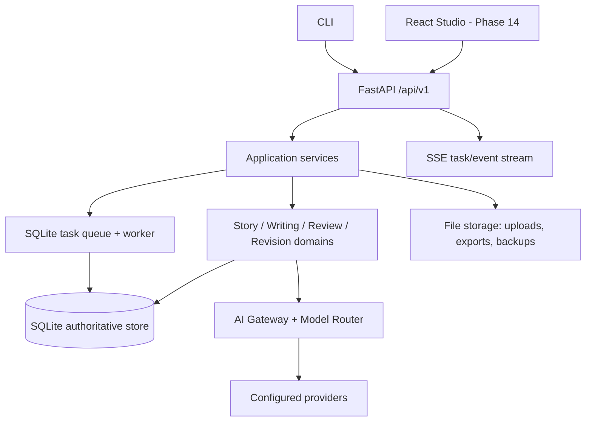

# NovelForge Architecture V2：系统架构

## 目标

NovelForge V2 是单机可部署的长篇小说创作 Studio：FastAPI 提供版本化 API 与事件流，一个持久化 worker 执行可恢复作业，SQLite 保存结构化故事事实和执行状态，文件存储只保存二进制附件、导出与备份。

## 边界

- API 不直接调用 DAL，也不以 `BackgroundTasks` 充当队列；它创建/读取任务并串流已持久化事件。
- Application service 负责事务、授权边界、兼容转换和错误映射。
- Domain service 不访问 HTTP，不依赖 UI；Agent 是由 Model Router 驱动的领域协作者。
- SQLite 是单写入者事实库；worker 对每个 Task 持有 lease，避免重复执行。
- 文件系统不保存可变领域真相；旧 JSON/Markdown 仅通过迁移/导入读取。

## 运行模型

同一进程可以托管 FastAPI 与 worker，但它们通过数据库通信。启动时 worker 先回收过期 lease，再恢复 `queued`/`paused`/可恢复 `failed` 任务；不可自动恢复的情况保留 checkpoint，要求用户明确选择。后续部署可以把 worker 独立为同一代码库的第二进程，不改变 API 或数据模型。

