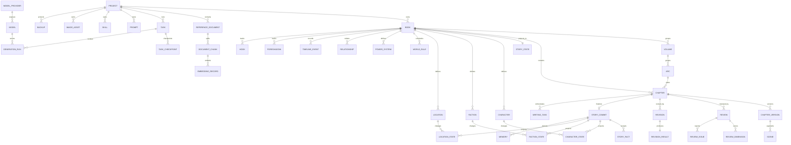

# NovelForge Architecture V2：领域模型

## 聚合与不变量

| 聚合 | 根 | 关键成员 | 不变量 |
|---|---|---|---|
| Project | Project | Book、ReferenceDocument、Provider 配置引用 | Project 不直接包含可变章节正文 |
| Book | Book | Volume、Arc、Chapter、Story Bible | 章节编号在 Book 内唯一 |
| Chapter | Chapter | ChapterVersion、Review、Revision、StoryCommit | 可发布版本必须由 accepted commit 指向 |
| Story | StoryState | StoryFact、状态投影、TimelineEvent、Foreshadow | 仅 accepted commit 可改变投影 |
| Task | Task | TaskCheckpoint、GenerationRun、事件 | 状态转换受状态机约束，worker lease 唯一 |
| Knowledge | ReferenceDocument | DocumentChunk、EmbeddingRecord、Memory、Summary | 每条检索结果可追溯来源/版本 |

## 正式实体目录

所有实体以不透明 ID 标识并记录 `created_at`、`updated_at`；不可变记录额外记录来源版本或 commit。下表的列为最低持久字段，具体索引由相应 Phase 的 migration 定义。

| Entity | 最低字段 | 生命周期/关系 |
|---|---|---|
| Project | id, name, settings, status | owns Book、附件与配置引用 |
| Book | id, project_id, title, genre, status | owns narrative aggregates |
| Volume / Arc | id, book_id, order, title, plan | ordered structure; Arc owns Chapter plan |
| Chapter / ChapterVersion / Scene | id, book_id, number, status / version, content, base_version / chapter_id, range, order | version append only; Scene references one version |
| Character / CharacterState | id, book_id, profile / character_id, commit_id, state | state derives only from accepted commit |
| Faction / FactionState | id, book_id, profile / faction_id, commit_id, state | state derives only from accepted commit |
| Location / LocationState | id, book_id, coordinates, hierarchy / location_id, commit_id, state | map is a Location read model |
| WorldRule / PowerSystem | id, book_id, rule, status / id, book_id, schema | approved constraints are protected context |
| Relationship | id, book_id, source_id, target_id, type, status | links characters, factions or locations |
| TimelineEvent | id, book_id, story_time, chapter_id, entities | immutable event source/commit reference |
| Foreshadow / Hook | id, book_id, status, introduced_chapter, resolved_chapter | state changes are commit-derived |
| StoryFact / StoryState / StoryCommit | id, commit_id, evidence / book_id, version, stale / id, chapter_version_id, status | accepted commit is the sole fact/state writer |
| WritingTask / Task / TaskCheckpoint | id, chapter_id, stage / id, type, status, lease / id, task_id, stage, state | task state machine and restart boundary |
| Review / ReviewDimension / ReviewIssue | id, chapter_version_id, verdict / id, review_id, score / id, review_id, severity, status | review is immutable input to revision |
| Revision / RevisionResult | id, review_id, base_version / id, revision_id, version_id, issue_map | creates a new ChapterVersion only |
| Memory / Summary | id, source_commit_id, category / id, source_id, scope | derived, versioned and staleable read models |
| ReferenceDocument / DocumentChunk / EmbeddingRecord | id, project_id, checksum, status / id, document_id, range / id, chunk_id, model, vector_ref | source traceability required for retrieval |
| Prompt / Skill | id, key, version, content / id, key, version, definition | resolved versions recorded by GenerationRun |
| GenerationRun | id, task_id, agent_role, model_id, prompt_version, status | every Provider invocation is observable |
| ModelProvider / Model | id, kind, credential_ref / id, provider_id, capabilities | credentials never stored in logs or API output |
| ImageAsset | id, project_id, entity_id, file_ref, provenance | file is an attachment, not story truth |
| Backup | id, scope, manifest_ref, checksum, status | verified before restoration |

## 实体关系

## 生命周期

- Chapter：`planned → drafting → drafted → reviewing → revising → accepted | rejected → committed`；编辑已提交章节会创建新 Version，并使受影响投影进入 `stale`，绝不静默覆盖。
- StoryCommit：`pending → accepted | rejected`；accepted 是不可变审计记录，投影失败为独立可重试状态。
- ReviewIssue：`open → fixed | waived`；waive 必须保存理由与作者身份/时间。
- ReferenceDocument：`uploaded → parsed → indexed | failed`；失败记录阶段和可重试原因。
