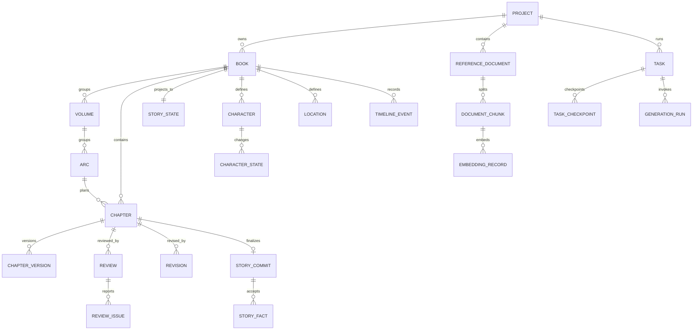

# NovelForge Architecture V2：领域模型

## 聚合与不变量

| 聚合 | 根 | 关键成员 | 不变量 |
|---|---|---|---|
| Project | Project | Book、ReferenceDocument、Provider 配置引用 | Project 不直接包含可变章节正文 |
| Book | Book | Volume、Arc、Chapter、Story Bible | 章节编号在 Book 内唯一 |
| Chapter | Chapter | ChapterVersion、Review、Revision、StoryCommit | 可发布版本必须由 accepted commit 指向 |
| Story | StoryState | StoryFact、状态投影、TimelineEvent、Foreshadow | 仅 accepted commit 可改变投影 |
| Task | Task | TaskCheckpoint、GenerationRun、事件 | 状态转换受状态机约束，worker lease 唯一 |
| Knowledge | ReferenceDocument | DocumentChunk、EmbeddingRecord、Memory、Summary | 每条检索结果可追溯来源/版本 |

## 实体关系

## 生命周期

- Chapter：`planned → drafting → drafted → reviewing → revising → accepted | rejected → committed`；编辑已提交章节会创建新 Version，并使受影响投影进入 `stale`，绝不静默覆盖。
- StoryCommit：`pending → accepted | rejected`；accepted 是不可变审计记录，投影失败为独立可重试状态。
- ReviewIssue：`open → fixed | waived`；waive 必须保存理由与作者身份/时间。
- ReferenceDocument：`uploaded → parsed → indexed | failed`；失败记录阶段和可重试原因。

