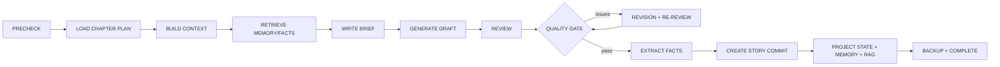

# NovelForge Architecture V2：单章写作 Pipeline

每个方框是 Task checkpoint 边界。PRECHECK 阻断缺失的 Story Bible、章节计划、模型配置、未解决的前序 commit 或过期投影。Draft 仅保存为 ChapterVersion，绝不覆盖作者已编辑版本。质量门同时检查 blocking issue、最低分、合同冲突和所需 artifacts；超过修订上限时进入 `needs_author_decision`，不虚假通过。

