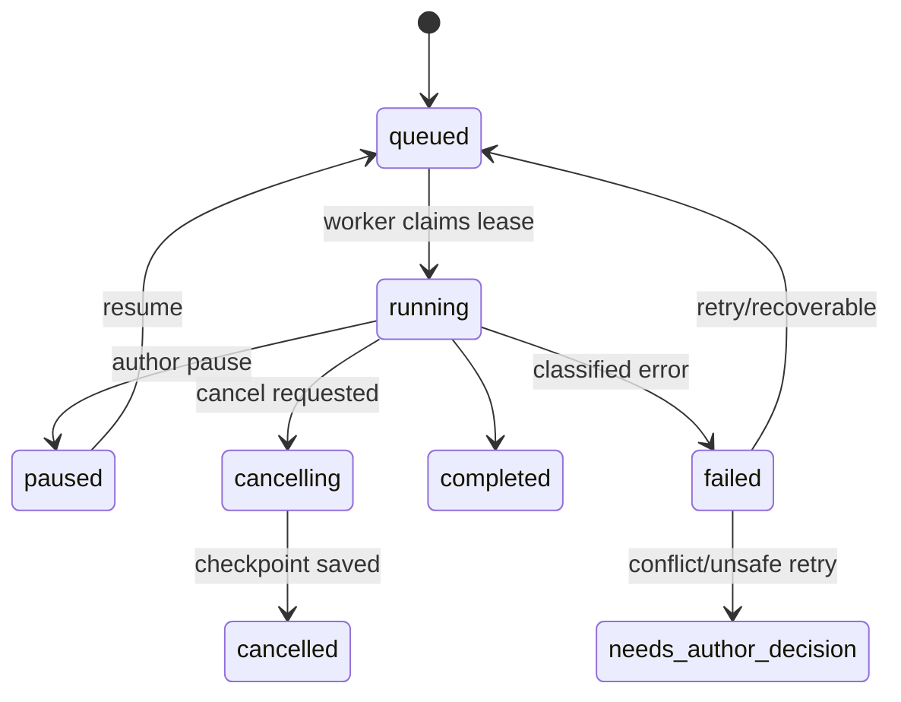

# NovelForge Architecture V2：任务与恢复

## 状态机

每次状态变化、阶段事件和 checkpoint 都在 SQLite 事务中写入。worker 使用 `lease_owner`/`lease_expires_at` 原子抢占任务；启动回收过期 lease。取消是协作式的：每个 Pipeline 边界读取 cancel flag、写 checkpoint、再转换为 cancelled。完成和失败不可由浏览器内存决定。

## 错误分类

- `VALIDATION`、`CONFLICT`、`MODEL_CONFIGURATION`：不自动重试。
- `NETWORK`、`RATE_LIMIT`、`PROVIDER_TRANSIENT`：限次指数退避并保存 attempt。
- `PROJECTION`：保留 accepted commit，独立重试投影，不重写章节。
- `DATA_INTEGRITY`：停止 worker，运行 Doctor，禁止继续提交。

