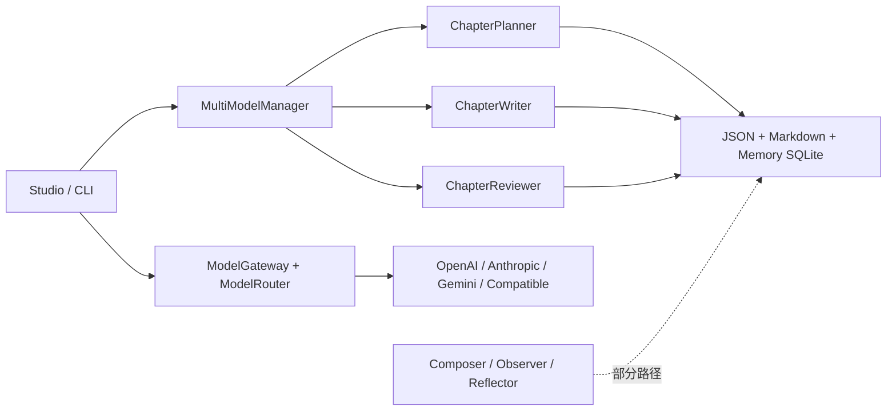

# NovelForge AI 与 Pipeline 清单

## 当前调用链

## 证据与缺口

| 能力 | 实现证据 | 当前状态 | V2 要求 |
|---|---|---|---|
| Provider 调用 | `gateway.py` 适配 5 类 Provider，单元测试 mock HTTP | TESTED（模块级） | 加密凭据、超时/限流/分类错误、审计日志 |
| Agent 路由 | `ModelRouter` 映射 8 个 Agent role，单元测试覆盖 | TESTED（模块级） | 每次 GenerationRun 固化 provider/model/prompt 版本 |
| 流式模型响应 | Provider `chat_stream` | PARTIAL | 统一 SSE 事件协议、持久化流末状态和取消 |
| Prompt 管理 | `PromptManager` 内置模板/文件 fallback | PARTIAL | Registry、版本、导入导出、恢复默认 |
| 世界观生成 | `WorldWizard.build_world` 一次 JSON 调用 | PARTIAL | 25 步确认、增量上下文、可回退、持久化草稿 |
| 章节规划 | `ChapterPlanner` | PARTIAL | 读取已确认 Bible、状态、RAG、预算和章计划 |
| 章节写作 | `ChapterWriter` | PARTIAL | 受 Task/Contract 控制的 Draft 产物与流式输出 |
| 单章审查 | `ChapterReviewer` 九维 JSON | PARTIAL | 结构化 Issues、证据位置、质量门、持久化 |
| 修订 | HTTP 端点/旧连续模式 | PARTIAL | 只使用审查 issue，产生版本与 Re-review |
| 事实提取/反射 | `Observer` / `Reflector` / `StorySystem` | PARTIAL | 只有 accepted commit 才投影；全部投影可重放 |
| 连续创作 | 三个 orchestrator 文件 | PARTIAL | DB 作业、lease、取消、暂停、检查点、恢复 |

## 不能宣称完成的路径

- Studio 的 `BackgroundTasks` 和全局字典不是任务队列；其 SSE 不是模型输出流。
- `AntiHallucinationLaws` 的方法目前返回空集合，不能作为真实一致性检查。
- `VectorIndex` 接受调用方提供的向量，未连接 Embedding Provider 或持久化记录。
- 无真实 Provider 凭据的环境只能验证确定性 contract/HTTP mock；真实模型 E2E 必须由配置有效凭据的单独验收运行证明。

